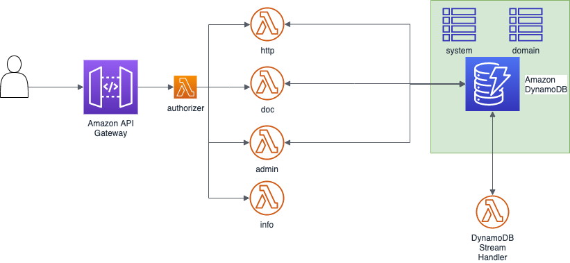

# dynamoplus

  

Dynamoplus is a serverless back-end written in python and based on AWS DynamoDB. 

Get started reading the [wiki](https://github.com/antessio/dynamoplus/wiki) 

## Related Projects

- [dynamoplus admin dashboard](https://github.com/antessio/dynamoplus-admin-dashboard): a web app to easily access to dynamoplus through a web interface. **Work in progress**. 

- [~~dynamoplus python sdk~~](https://github.com/antessio/dynamoplus-python-sdk): a python sdk to access to dynamoplus API (**Currently not mantained it was implemented on version 0.1**.

- [dynamoplus end-to-end tests](https://github.com/antessio/dynamoplus-e2e-tests): java junit project to run end to end tests
on dynamoplus APIs

- [dynamoplus Java sdk](https://github.com/antessio/dynamoplus-java-sdk): java sdk to call the API
